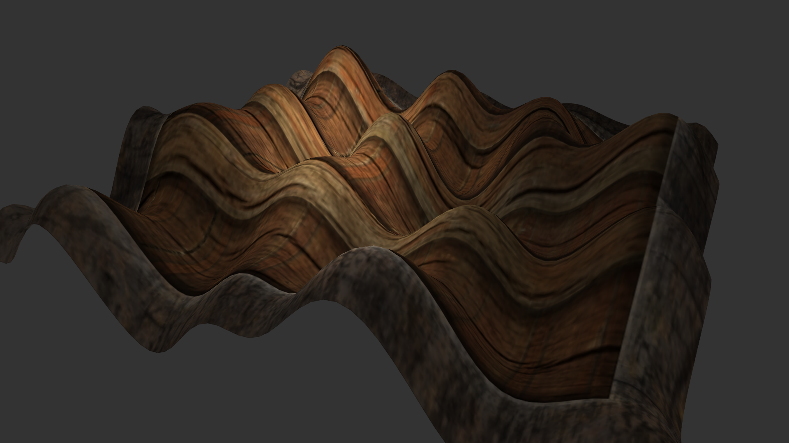

# LearnOpenGL.V2
This is a Repository for backing up and documenting my progress on learning OpenGL via the LWJGL library.
I am still working partially on this project since I'm a student.

# Screenshots
Terrain loaded through a paint.net generated heightmap.

Procedurally generated terrain with the seed "Hello World!".

Terrain rendered with lines

Terrain culling from the normally invisible sides

Terrain culling toggled
